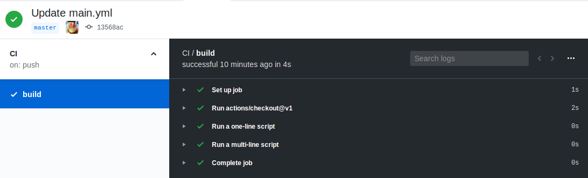

# chisel-ci
ChiselのCI環境を構築するためのお試し環境

## とりあえずお試し。

よく分からずに`blank.yaml`を作ってみたけどActionsののページに何も起こらず。。。

## もう一回トライ

最初は"Start Commit"を押した際にプルリクを使った。
その後にマージをした所設定用のYAMLファイルがリポジトリのルート直下に生成されていた。
もう一度セットアップをしてみたと所".github/workflows"の下に"main.yaml"が生成されていた。


この状態でコミットしてプッシュしてみる。

なんか動いた！


タスクの詳細を開いてみると" successful 12 minutes ago in 4s "と出て成功していた。



## main.yamlを確認

実行されたCIワークフローは以下の様なもの。
[github actionsで実際に実行されたワークフロー](https://github.com/diningyo/chisel-ci/commit/6cc47d53a56f08e1a4687b85967161fb35e83e31/checks?check_suite_id=252554143)と併せて確認すると、何も知らなくてもなんとなく感じ。

```yaml
name: CI # ワークフローの名称

on: [push] # トリガーアクション。今回はpush時に実行

jobs:
  build:

    runs-on: ubuntu-latest # 最新版のUbuntuで実行する

    steps:
    - uses: actions/checkout@v1
    - name: Run a one-line script # 1行のスクリプトを実行
      run: echo Hello, world!
    - name: Run a multi-line script # 複数行のスクリプトを実行
      run: |
        echo Add other actions to build,
        echo test, and deploy your project.
```

